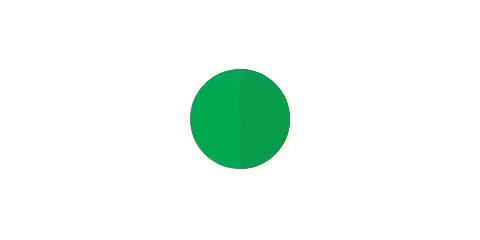

## GmailLikeLoading ##

Gmail iOS app like Loading view. 

Completely created using core animation.

Easy to drop into your project like a UIView.

You can resize the frame to whatever size.

## How to use ##
	
Drag GmailLikeLoadingView.h amd GmailLikeLoadingView.m files to your project.

###Required framework:### QuartzCore.framework

`#import "GmailLikeLoadingView.h"`

`GmailLikeLoadingView *loadingView = [[GmailLikeLoadingView alloc] initWithFrame:CGRectMake(x, y, width, height)];
[self addSubview:view];
[view startAnimating];`

###To stop animating:###

`[view stopAnimating];`

###To Check view is animating:###

`view.isAnimating`

##How it looks##

  

![Screenshot] (GmailLikeLoading.gif)

## Lincense ##

[MIT License] ( "MIT License")
